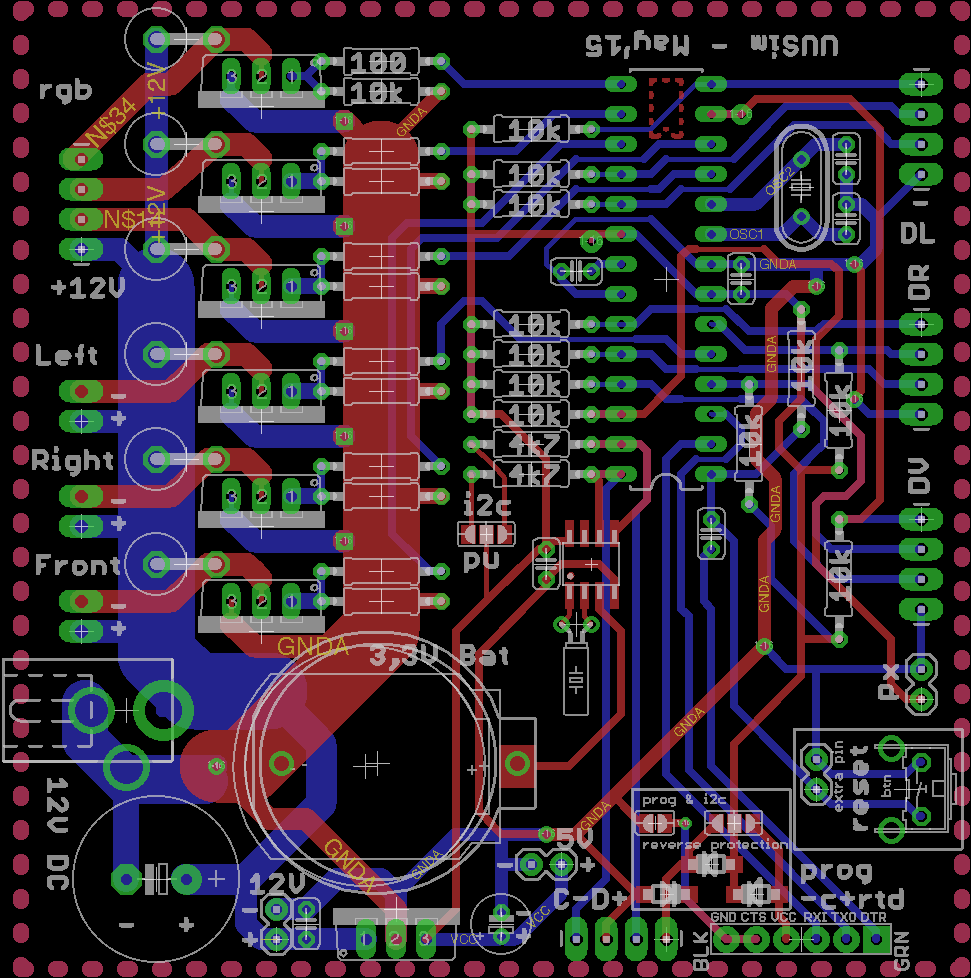

# 6 Channel LED controller board
This project hosts the Eagle-based design of a 6 channel LED controller.

The device features:
- DC power (rated 7-12V)
- Powered via i2c bus connector (TBD)
- Controlled via 3 rotary encoders:
  - Intensity for 2 separate LED sections
  - One color wheel
- Clock with battery backup
- Programming header
- External i2c-bus connector

The 6 channels are configured as follows:
- 1 RGB connector
- 3 separate connectors for a color of choice

Note: The board is layed out such that diy etching is possible using double-sided UV-lighting and etching. The traces are routed such that the number of vias is kept to a minimum (avoiding trough-hole plating).
